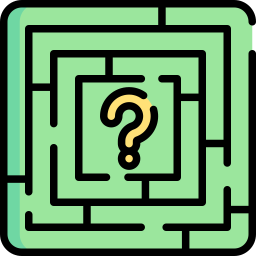

  

##  32 Bit Internship Project - Recursive Maze Solver

It is expected that the following work will be completed and the web link of the project will be shared via e-mail or in an environment open to remote access, in order to examine the ability to program and set up algorithms.

A simple game is expected to be written using the Java programming language played on a chessboard. The features of the game and the rules to be followed are listed below.

* The game aims to make a white checker go from one end (A1) to the other (H8) on the game board.
On the game board at the beginning of the game;

* White stamp must be placed in A1 position.

* Between 3 and 9 black checkers must be placed as randoms so as not to break the rules of the game. The game should always be able to end.

Scales cannot eat or jump over each other. The game is over when the white checker, which will start from the A1 point, reaches the H8 position. While the white washer reaches the H8 position; Must encounter at least one black flake. The positions of the black checkers encountered on the way to the H8 position must be indicated at the end of the game.

The white washer must reach the H8 position by the shortest possible route. The steps followed by the white checker must be indicated at the end of the game.

While developing applications, attention should be paid to the following issues:

* Over Design: Try to solve the problem in the simplest and simplest way.

* Communication: ASK about the parts of the project that you do not understand or are not sure about. (You can get help at the points where you get stuck.)

* Take care to write easy-to-read and understandable code. Do not forget to add "comments" where necessary.

##  Build With

##  Contact Information

You can reach out to me using the following contact details:

I'm always open to development and collaboration. Feel free to reach out to me!